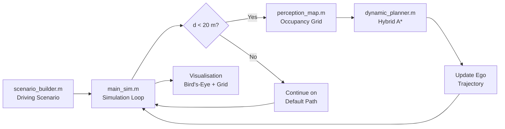

# Verification Artifact — Mathematical Rationale & Parameter Tuning

> **Project**: SIH – Adaptive Path Planning for Unstructured Indian Roads  
> **Type**: Software-in-the-Loop (SIL) Simulation using MATLAB

---

## 1. Occupancy Grid Resolution

### Design Choice

| Parameter | Value | Unit |
|-----------|-------|------|
| Grid width | 120 | m |
| Grid height | 20 | m |
| Resolution | 2 | cells/m |
| Cell size | 0.5 | m |
| Grid dimensions | 240 × 40 | cells |
| Total cells | 9,600 | — |

### Mathematical Justification

The cell size $\delta$ must satisfy two competing constraints:

**Constraint 1 — Obstacle Fidelity**:  
The cell must be small enough to represent the smallest obstacle dimension faithfully:

$$\delta \leq \frac{w_{\min}}{2}$$

where $w_{\min} = 1.5\,\text{m}$ (auto-rickshaw width). This gives $\delta \leq 0.75\,\text{m}$.  
Our choice of $\delta = 0.5\,\text{m}$ satisfies this with margin.

**Constraint 2 — Computational Budget**:  
The Hybrid A\* search complexity is $O(N \cdot b^d)$ where $N$ is the number of grid cells and $b^d$ is the branching factor. At 20 Hz re-planning rate, each plan call has a budget of $\sim$50 ms. With 9,600 cells (vs. 38,400 at $\delta = 0.25\,\text{m}$), we stay well within budget on modern hardware.

**Constraint 3 — Vehicle Clearance**:  
The ego vehicle width is $w_{\text{ego}} = 1.8\,\text{m}$, spanning $\lceil 1.8 / 0.5 \rceil = 4$ cells laterally. This provides sufficient granularity for the planner to find gaps ≥ 1 lane wide.

---

## 2. Obstacle Inflation Radius

### Design Choice

$$r_{\text{inflate}} = 1.0\,\text{m}$$

### Justification

The inflation radius creates a "keep-out zone" around obstacles. It must satisfy:

$$r_{\text{inflate}} \geq \frac{w_{\text{ego}}}{2} + \epsilon_{\text{safety}}$$

where:
- $w_{\text{ego}} / 2 = 0.9\,\text{m}$ (half the ego vehicle width)
- $\epsilon_{\text{safety}} \geq 0.1\,\text{m}$ (minimum safety buffer)

This gives $r_{\text{inflate}} \geq 1.0\,\text{m}$.

> [!NOTE]
> Inflation is applied *after* the raw obstacle footprint is projected onto the grid. The `inflate()` function in MATLAB's Navigation Toolbox grows occupied cells by the specified radius using morphological dilation.

---

## 3. Hybrid A\* Planner Parameters

### State Space

The Hybrid A\* planner searches in $SE(2) = \mathbb{R}^2 \times S^1$, i.e., position $(x, y)$ plus heading $\theta$. Unlike standard A\*, each node stores a continuous heading, ensuring kinematic feasibility.

### Key Parameters

| Parameter | Value | Rationale |
|-----------|-------|-----------|
| `MinTurningRadius` | 4.0 m | Based on a typical Indian sedan turning circle of ~10 m diameter. $R_{\min} \approx D/2.5 = 4.0\,\text{m}$ accounts for the bicycle model approximation. |
| `MotionPrimitiveLength` | 3.0 m | Length of each expansion arc. Must be $\geq 2\delta = 1.0\,\text{m}$ to span at least 2 cells. Set to 3.0 m for smoother arcs. |
| `ForwardCost` | 1.0 | Unit cost per metre of forward travel. |
| `ReverseCost` | 10.0 | Heavy penalty discourages reverse driving (unsafe on Indian roads with following traffic). |
| `DirectionSwitchingCost` | 20.0 | Large penalty prevents unnecessary back-and-forth oscillations. |
| `InterpolationDistance` | 0.15 m | = `MotionPrimitiveLength / 20`. Generates 20 interpolated points per primitive for smooth paths. |
| `ValidationDistance` | 0.3 m | Collision checks every 0.3 m along each primitive. Must be $\leq \delta = 0.5\,\text{m}$ for safety. |

### Minimum Turning Radius — Derivation

For a bicycle model with wheelbase $L$ and maximum steering angle $\delta_{\max}$:

$$R_{\min} = \frac{L}{\tan(\delta_{\max})}$$

For a typical sedan: $L = 2.7\,\text{m}$, $\delta_{\max} = 35°$:

$$R_{\min} = \frac{2.7}{\tan(35°)} = \frac{2.7}{0.700} \approx 3.86\,\text{m}$$

Rounded up to $R_{\min} = 4.0\,\text{m}$ for safety margin.

---

## 4. Detection Threshold

### Design Choice

$$d_{\text{detect}} = 20\,\text{m}$$

### Justification

At $v = 10\,\text{m/s}$, the ego has a time-to-collision of:

$$t_{\text{TTC}} = \frac{d_{\text{detect}}}{v} = \frac{20}{10} = 2.0\,\text{s}$$

This must exceed the planning time + execution time:

$$t_{\text{TTC}} \geq t_{\text{plan}} + t_{\text{manoeuvre}}$$

where:
- $t_{\text{plan}} \approx 0.05\,\text{s}$ (single Hybrid A\* call)
- $t_{\text{manoeuvre}} \approx \frac{\Delta y \cdot R_{\min}}{v}$ — time to execute a lane-change arc

For a 3.5 m lateral shift with $R_{\min} = 4.0\,\text{m}$:

$$\theta = \arcsin\left(\frac{\Delta y}{2R_{\min}}\right) = \arcsin\left(\frac{3.5}{8.0}\right) \approx 25.9°$$

$$\text{Arc length} = 2R_{\min} \cdot \theta \approx 2 \times 4.0 \times 0.452 = 3.62\,\text{m}$$

$$t_{\text{manoeuvre}} \approx \frac{3.62}{10} = 0.36\,\text{s}$$

Total: $0.05 + 0.36 = 0.41\,\text{s} \ll 2.0\,\text{s}$.  
The 20 m threshold provides a **~5× safety factor**.

---

## 5. Simulation Timing

| Parameter | Value | Rationale |
|-----------|-------|-----------|
| `SampleTime` | 0.05 s | 20 Hz — matches typical LiDAR/camera sensor rates |
| `StopTime` | 30 s | Enough for ego to traverse 300 m at 10 m/s (road is 100 m) |
| `ReplanCooldown` | 1.0 s | Prevents redundant replans within the same obstacle encounter |

---

## 6. System Architecture

---

## 7. Toolbox Dependencies

| Toolbox | Functions Used |
|---------|---------------|
| Automated Driving Toolbox | `drivingScenario`, `vehicle`, `road`, `lanespec`, `smoothTrajectory`, `advance` |
| Navigation Toolbox | `binaryOccupancyMap`, `stateSpaceSE2`, `validatorOccupancyMap`, `plannerHybridAStar` |

> [!IMPORTANT]
> Both toolboxes are required. Verify with `ver` in MATLAB. Minimum recommended version: **R2022b**.
